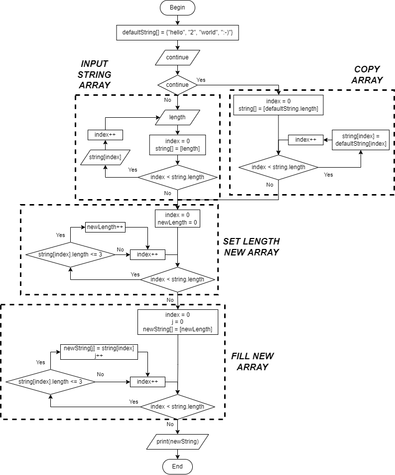

## Задача
  Написать программу, которая из имеющегося массива строк формирует массив из строк, длина которых меньше либо равна 3 символа.

## Условия
+ Первоначальный массив можно ввести с клавиатуры, либо задать на старте решения алгоритма.
+ При решении не рекомендуется пользоваться коллекциями, лучше обойтись исключительно массивами.

## Алгоритм решения

1. На начальном этапе необходимо спросить у пользователя, хочет ли он продолжить с массивом по умолчанию, или же ввести свой.
   1. Если пользователь решит ввести свой массив, в первую очередь необходимо спросить у него, сколько он будет вводить значений.
   2. Если же пользователь решить продолжить с массивом по умолчанию, необходимо его переписать в массив, с которым будем работать далее.
2. Для инициализации нового массива необходимо опеределить его длину (пробегаемся по массиву, считаем кол-во удовлетворяющих значений).
3. Заполняем новый массив значениями, длина которых меньше или равной трём символам.
4. Выводим пользователю полученный массив.

### Описание основных методов

+ INPUT STRING ARRAY - ввод пользователем массива строк.
+ COPY ARRAY - перезапись массива.
+ SET LEHGTH NEW ARRAY - определение длины нового массива.
+ FILL NEW ARRAY - заполнение нового массива соответствующими значениями.

